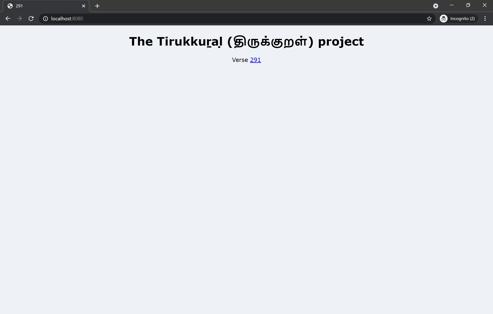
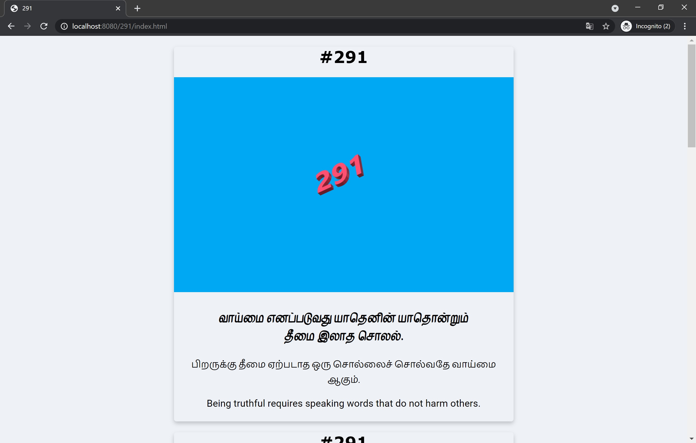

# The Tirukkuṟaḷ (திருக்குறள்) project
I am embarking on a passion project on the side and looking for collaborators.

## Concept
Bring classical Tamil literary works to the younger generation in digital / multimedia formats  Works Chosen: To start with we shall begin with the classical work Tirukkuṟaḷ (திருக்குறள்). Other works shall be taken up in due course.  

## Help needed
We need volunteers in multiple skill areas.  
  - **Illustrators:** Each of the 133 chapters and each of the 1330 verses shall be illustrated 
  - **Content editors:** Responsible for formatting and organizing the content under the project's standards and guidelines 
  - **Translators:** Responsible for translating the verses into different languages. Our goal is to make this work accessible in every language. 
  - **Designers:** Responsible for the layout and design of artefacts  
We probably need more roles. This is just a starting list.  

## Targeted Delivery formats
Physical flash cards, eBook, print book, Website, App to start with.

### Flashcard example


This is a massive project. If you love Tamil language and classical works, have the skills and would like to volunteer or contribute in some form, please mention it in the comment or InMail me. (https://linkedin.com/in/vvgiri) 

This GitHub repository is for managing the collaboration workspace and artefacts.

## Specifications

### Mockups folder

The [`mockups` folder](./mockups) has some examples of how to organize the content. We will use the standard Kural numbering (from the original book). Each verse shall get its own folder that contains the following files:

+ parent_folder
  + verse_number
    + verse_number.jpg  (The illustration for the verse)
    + data.xml          (The verse semantic content)
    + index.html        (The verse document)
  + another verse
  + ...
  + css
    + style.css
  + index.html   (The root document)

See the `mockups` folder for an example for [Kural #291](./mockups/291/index.html). 

> **Tip:**
> To locally serve the HTML files, you can use the NodeJS module `http-server`
> First install NodeJS. Follow [instructions here](https://nodejs.org/en/download/).
> 
> Install `http-server` module [using npm](https://www.npmjs.com/package/http-server).
> 
> You can then run the web server locally from the `mockups` folder






### XML Spec

Refer to [data.xml](./mockups/291/data.xml) for an example of the XML for a single verse.

```
<?xml version="1.0" encoding="utf-8"?>
<data>
  <verse number="291">வாய்மை எனப்படுவது யாதெனின் யாதொன்றும்<br>தீமை இலாத சொலல்.</verse>
  <illustration href="291.jpg"></illustration>
  <explanations>
    <explanation lang="ta-IN" label="பரிமேலழகர் உரை">
      <text>வாய்மை எனப்படுவது யாது எனின் - மெய்ம்மை என்று சிறப்பித்துச் சொல்லப்படுவது யாது என்று வினவின், தீமை யாதொன்றும் இலாத சொலல் - அது பிறிதோருயிர்க்குத் தீங்கு சிறிதும் பயவாத சொற்களைச் சொல்லுதல். ('தீமை யாதொன்றும் இலாத' என இயையும். 'எனப்படுவது' என்பது 'ஊர் எனப்படுவது உறையூர்' என்றாற் போல நின்றது. இதனான் நிகழ்ந்தது கூறல் என்பது நீக்கப்பட்டது. அது தானும், தீங்கு பயவாதாயின் மெய்ம்மையாம் : பயப்பின் பொய்ம்மையாம் என்பது கருத்து.)</text>
      <translation lang="en-US">To be done.</translation>
    <explanation>
    <explanation lang="ta-IN" label="கலைஞர் உரை">
      <text>பிறருக்கு   எள்முளையளவு   தீமையும்  ஏற்படாத  ஒரு  சொல்லைச் சொல்வதுதான் வாய்மை எனப்படும்.</text>
      <translation lang="en-US">To be done.</translation>
    <explanation>
    <explanation lang="ta-IN" label="சாலமன் பாப்பையா உரை">
      <text>உண்மை என்று சொல்லப்படுவது எது என்றால், எவர்க்கும் எத்தகைய தீங்கையும் தராத சொற்களைச் சொல்வதே ஆகும்.</text>
      <translation lang="en-US">To be done.</translation>
    </explanation>
    <explanation lang="ta-IN" label="திருக்குறள் எளிய உரை">
      <text>பிறருக்கு தீமை ஏற்படாத  ஒரு  சொல்லைச் சொல்வதே வாய்மை ஆகும்.</text>
      <translation lang="en-US">Being truthful requires speaking words that do not harm others.</translation>
    </explanation>
  </explanations>
</data>
```

There are many classical commentaries (உரை) that are available. We will use the following:

1. பரிமேலழகர் உரை: This is the classical commentary (c. 13<sup>th</sup> century CE) by [Parimelazhagar](https://en.wikipedia.org/wiki/Parimelalhagar).
2. கலைஞர் உரை: This is the contemporary commentary by the late Kalignar M. Karunanidhi, Tamil scholar and politician.
3. சாலமன் பாப்பையா உரை: This is the contemporary commentary by the Tamil scholar and teacher, Solomon Pappiah.

In addition, we shall be creating the simple commentary in multiple languages:
4. திருக்குறள் எளிய உரை: This is the simple commentary and explanation from this project.

> **Note:** We need experts in Tamil language who can read these commentaries and distill
> them into simple Tamil explanation. We also need bi-lingual experts who know Tamil and their
> native language and can do the translation into their language. We also need editors who can
> proof-read, edit, correct and make suggestions to ensure the final outcome is good.
> Our goal is to ensure that the work is accessible to children and youth.